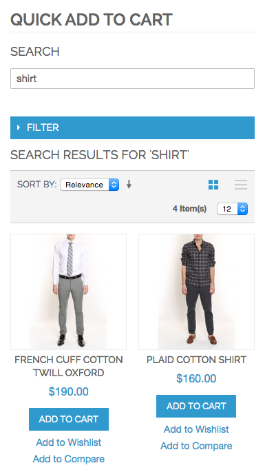

Quick Add To Cart
=================

A page where you can quickly add products to the cart. Page can be standalone
or embedded elsewhere, such as the customer dashboard. All functionality is 
Ajax based.

Enter a search terms and hit return:

Tap/click on the Add to Cart button. If there are options, the following popup will appear:

Product will be added to your cart:

How to use
----------

Upload the files to your website, turn off compilation, clear cache, etc. Page is at /quickaddtocart.

